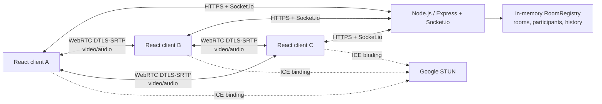

# TDD — Видеочат-комната

| Поле | Значение |
| --- | --- |
| Версия | 2.0 |
| Дата | 2026-09-16 |
| PRD | [`prd-video-chat-room.md`](../../prd-video-chat-room.md) (v1.0) |
| Feature name | `video-chat-room` |
| Статус | Готово к реализации с открытыми вопросами из раздела 14 |

## 1. Overview / Контекст

Нужно создать русскоязычное desktop-веб-приложение (Chrome, Firefox и Edge 100+, ширина от 1024 px) для видеозвонка до четырёх равноправных участников. Пользователь вводит имя, создаёт комнату либо входит по URL, обменивается аудио/видео и сообщениями. Регистрации, постоянного хранения, ролей, TURN, мобильной версии и автоматического переподключения нет.

Зафиксированные PRD ограничения: JavaScript ES6+, React в браузере, Node.js на сервере, Socket.io для сигналинга/чата и WebRTC mesh для медиа. При четырёх участниках mesh образует максимум шесть `RTCPeerConnection`; каждый клиент передаёт максимум трём peers. Медиа проходит P2P, сервер не является медиасервером.

Технические решения этого TDD:

- React SPA собирается Vite; сервер — Node.js + Express + Socket.io. Express обслуживает health endpoint и production-статические файлы, Socket.io работает на том же HTTPS origin.
- URL комнаты: `/room/:roomId`. При создании `roomId` — `crypto.randomUUID()`. При входе разрешается нормализованный сегмент `^[A-Za-z0-9_-]{1,64}$`; отсутствующая комната с допустимым ID создаётся при успешном входе.
- Комнаты, участники и история существуют только в памяти одного процесса. Следовательно, MVP запускается одним экземпляром сервера; горизонтальное масштабирование без общего state не допускается.
- STUN-конфигурация: `stun:stun.l.google.com:19302`. TURN отсутствует по PRD; частичная недостижимость peer при строгом NAT показывается в UI как проблема подключения конкретного участника, но не завершает комнату.
- Максимум сообщения — 2 000 Unicode code points; сервер применяет простой per-socket rate limit 10 сообщений/10 секунд. Это выбранная реализация пункта «защита от флуда» PRD.

## 2. Current Architecture & Codebase Summary

Репозиторий проверен как greenfield: на момент подготовки TDD в нём нет исходного кода, зависимостей, конфигурации, тестов или схем БД. Присутствуют только входные документы `prd-video-chat-room.md`, `prd-design.mdc` и неиспользованный в данном запросе `prd-tasks.mdc`.

| Путь | Класс / функция | Назначение / находка |
| --- | --- | --- |
| `prd-video-chat-room.md` | PRD v1.0 | Функциональные требования, acceptance criteria и обязательный стек. |
| `prd-design.mdc` | Правило TDD | Обязательная структура настоящего документа; production-код не создаётся. |
| Исходные модули | — | Отсутствуют; существующей архитектуры, API, БД и тестов нет. |

Начальная целевая структура, которую создаст реализация (это план, не существующий код):

```text
client/src/
  app/                 # router, composition root
  features/room/       # join flow, room screen, media controls
  entities/participant/ # presentation models and tiles
  shared/socket/       # Socket.io client and contracts
  shared/webrtc/       # peer-connection manager
server/src/
  app.js               # Express/HTTP/Socket.io composition
  rooms/roomRegistry.js # in-memory room lifecycle, invariant <= 4
  socket/roomGateway.js # validated Socket.io event handlers
  validation/          # name, room ID and message validation
shared/                # event names and payload schemas
```

## 3. Proposed Architecture / High-Level Design



Сервер — источник истины только для состава комнаты, истории текущей сессии и системных событий. Он не проксирует media и не записывает данные. В браузере `RoomSession` координирует Socket.io, `MediaController` управляет локальными треками, а `PeerConnectionManager` хранит соединение на каждого удалённого участника. Все DOM-тексты отображаются React как текст, не HTML.

`RoomRegistry.join()` выполняется синхронно внутри единственного Node event loop и возвращает результат до рассылки событий. Поэтому проверка свободного слота и добавление участника составляют одну неразрывную операцию. Нельзя проверять размер комнаты отдельно от добавления в Socket.io handler.

## 4. Components & Interfaces

| Компонент | Ответственность | Входы / выходы |
| --- | --- | --- |
| `LandingPage` / `JoinDialog` | Ввод имени, локальная проверка, генерация нового room ID, переход по URL. | `create room`, `join room`; ошибок сети ещё нет. |
| `RoomPage` | Композиция сетки, self-view, чата, списка и состояния ошибок. | Модели участников, сообщения, media state. |
| `RoomSession` | Единственный владелец socket-сессии; отключает Socket.io reconnection; вызывает join/leave. | Socket events ↔ UI store и `PeerConnectionManager`. |
| `MediaController` | Проверяет WebRTC, запрашивает media, останавливает/recreates video track, включает/выключает аудио, обрабатывает `ended`. | `MediaStream`, `{audioEnabled, videoEnabled}`, предупреждения. |
| `PeerConnectionManager` | По одному `RTCPeerConnection` на remote participant, SDP/ICE, remote streams, cleanup. | `signal:offer/answer/ice`, `peerConnectionState`. |
| `RoomRegistry` | `Map<roomId, Room>`; атомарное join, leave, очистка пустой комнаты, журнал сообщений. | Доменный результат `joined` или `ROOM_FULL`. |
| `RoomGateway` | Валидирует Socket.io payload, применяет registry и направляет события только сокетам той же комнаты. | Контракты раздела 6. |
| HTTP app | `/healthz`, статика SPA, TLS-terminating deployment boundary. | `GET /healthz → 200`. |

Клиент должен создавать socket с `reconnection: false` и `autoConnect: false`. Он соединяется только после явного действия входа пользователя («Создать комнату», «Войти» или «Повторить вход»). Обработка `disconnect` зависит от состояния текущей сессии:

- **Ожидаемый disconnect:** клиент намеренно завершает сессию по кнопке «Выйти», при уходе со страницы комнаты или закрытии/перезагрузке вкладки. `RoomSession` устанавливает состояние `leaving` до отправки `room:leave` и до вызова `socket.disconnect()`. UI завершает выход без сообщения о потере связи; по кнопке «Выйти» открывается стартовый экран.
- **Неожиданный disconnect:** соединение прерывается без инициированного клиентом завершения сессии, в том числе при потере сети или отключении сервером. UI переходит в состояние `disconnected` с сообщением «Соединение с сервером потеряно. Войдите снова». Возврат возможен только новым ручным входом.

В обоих случаях очистка идемпотентна: закрываются peer connections, останавливаются все локальные media tracks, снимаются обработчики и очищается состояние сессии. Автопереподключение и silent rejoin запрещены. Ожидаемость определяется намерением завершить конкретную сессию, а не только строкой причины `disconnect`. Программное отключение при обработке ошибки входа сохраняет исходную ошибку (например, «Комната заполнена»), не заменяя её сообщением о потере связи. Запоздалые события завершённой сессии не изменяют состояние нового ручного входа.

### Инварианты домена

1. У участника есть один `socketId`, одно `participantId` (socket ID допустим как внутренний ID) и одна комната.
2. У комнаты от 1 до 4 участников. Пустая комната удаляется вместе с `messages` немедленно после `leave`/`disconnect`.
3. Имя не уникально; идентичность и адресация сигналинга используют только internal ID.
4. Участник считается членом комнаты только после `room:join` acknowledgement `ok: true`; только тогда ему разрешены message, signal и media-state events.
5. Сервер никогда не отправляет входящий клиентский payload напрямую без validation/normalization.

## 5. Data Model & DB Changes

База данных, миграции, индексы и persistent cache не нужны: PRD требует in-memory state лишь на время жизни комнаты.

```js
// Server memory model; not a database schema
Room = {
  id: 'room-id',
  participants: Map<participantId, {
    id: 'socket-id',
    socketId: 'socket-id',
    displayName: 'Алекс',
    audioEnabled: true,
    videoEnabled: true,
    joinedAt: 1720000000000
  }>,
  messages: [{
    id: 'uuid', type: 'user' | 'system', text: '...',
    senderId: 'socket-id | null', senderName: 'Алекс | null',
    createdAt: '2026-09-14T10:00:00.000Z'
  }]
}
```

`messages` хранит максимум 500 элементов на комнату: при переполнении удалить самый старый, чтобы отдельная активная комната не исчерпала память. Это технический защитный лимит; пользовательская история остаётся доступной в пределах текущей сессии и установленного лимита. Нужна продуктовая валидация этого лимита — см. TBD-3.

Поле `createdAt` хранится сервером в UTC ISO-8601. Клиент форматирует его через `Intl.DateTimeFormat` в локальном timezone пользователя как `HH:mm`; сервер не должен рассчитывать «локальное время клиента».

## 6. API / Contracts

### HTTP

| Метод / путь | Ответ | Назначение |
| --- | --- | --- |
| `GET /healthz` | `200 {"status":"ok"}` | Liveness/readiness для deployment. |
| `GET /room/:roomId` | SPA HTML | Клиент читает `roomId` из router. |
| `GET /*` | SPA HTML | Стартовая страница и client routing. |

HTTP не содержит комнатной логики и не имеет REST API для сообщений/участников.

### Socket.io events

| Направление | Событие | Payload / acknowledgement | Семантика |
| --- | --- | --- | --- |
| C→S | `room:join` | `{roomId, displayName}` → `{ok:true, self, participants, messages}` или `{ok:false, code, message}` | Валидирует, атомарно резервирует слот, создаёт комнату при отсутствии. |
| S→C | `room:participant-joined` | `{participant}` | Рассылается прежним членам после join; они инициируют WebRTC offer новому peer. |
| S→C | `room:participant-left` | `{participantId, message}` | Удаляет tile/PC; message уже добавлено в журнал. |
| C→S | `room:leave` | `undefined` → `{ok:true}` | Идемпотентный explicit leave; затем socket disconnect. |
| C→S | `chat:send` | `{text}` → `{ok:true}` или validation error | Сервер normalizes, appends user message, broadcast. |
| S→C | `chat:message` | `Message` | Пользовательское или системное сообщение для всех членов. |
| C→S | `media:state` | `{audioEnabled, videoEnabled}` | Обновляет state участника и broadcast. |
| S→C | `room:media-state` | `{participantId, audioEnabled, videoEnabled}` | Обновляет remote tile; не заменяет WebRTC track operation. |
| C→S | `signal:offer` / `signal:answer` | `{targetId, sdp}` | Relay только target из той же комнаты. |
| C→S | `signal:ice` | `{targetId, candidate}` | Relay только target из той же комнаты. |
| S→C | `signal:offer` / `signal:answer` / `signal:ice` | `{fromId, sdp|candidate}` | Адресный signaling relay. |
| S→C | `server:error` | `{code, message}` | Невосстановимая ошибка протокола; клиент оставляет/покидает комнату согласно коду. |

Пример join:

```json
{ "roomId": "a6ad54a8-2f4f-4f0c-9c4f-a3346ba0202c", "displayName": "Алекс" }
```

```json
{
  "ok": true,
  "self": {"id":"socket-1","displayName":"Алекс","audioEnabled":false,"videoEnabled":false},
  "participants": [{"id":"socket-2","displayName":"Алекс","audioEnabled":true,"videoEnabled":true}],
  "messages": [{"id":"m-1","type":"system","text":"Мария присоединился к комнате","createdAt":"2026-09-14T10:00:00.000Z"}]
}
```

Ошибки acknowledgement: `INVALID_ROOM_ID`, `INVALID_DISPLAY_NAME`, `ROOM_FULL`, `NOT_IN_ROOM`, `INVALID_MESSAGE`, `RATE_LIMITED`, `INVALID_SIGNAL_TARGET`. UI показывает «Комната заполнена» только для `ROOM_FULL`; прочие сообщения — понятные русские, без технических деталей.

## 7. Data & Control Flows

### Вход и установление mesh

```mermaid
sequenceDiagram
  participant N as Новый browser
  participant S as Socket.io server
  participant E as Существующий browser
  N->>N: validate name, request getUserMedia
  N->>S: room:join(roomId, name)
  S->>S: RoomRegistry.join atomically
  alt свободный слот
    S-->>N: ack(self, participants, messages)
    S-->>E: participant-joined(new participant)
    S-->>E: chat:message(system joined)
    S-->>N: chat:message(system joined)
    E->>N: signal:offer via S
    N->>E: signal:answer via S
    E->>N: signal:ice via S
    N->>E: signal:ice via S
    E-->>N: WebRTC DTLS-SRTP media P2P
  else комната заполнена
    S-->>N: ack(ROOM_FULL)
    N->>N: show retry; do not create peer connections
  end
```

Порядок важен: media permission может быть запрошен до `room:join`, но отказ, отсутствие устройства или `NotFoundError` не отменяют join. В таком случае `MediaController` создаёт пустой stream и state `false/false`; пользователь входит, а сервер рассылает его корректные state. Нажатие «Войти» является жестом autoplay. Если браузер всё же блокирует `video.play()`, tile показывает кнопку «Включить звук», повторно вызывающую `play()` по жесту.

### Управление камерой и микрофоном

1. Микрофон: установить `audioTrack.enabled = false`, немедленно отправить `media:state`; удалённые peers больше не получают аудиокадры. При включении — `true`.
2. Камера off: выполнить `videoTrack.stop()`, удалить локальный video track из локального stream, для всех video senders вызвать `replaceTrack(null)`, затем `media:state(videoEnabled:false)`.
3. Камера on: вызвать `getUserMedia({video:true,audio:false})`, добавить новый track, `replaceTrack(newTrack)` для каждого peer, затем broadcast true. Если получить track не удалось, остаться без видео и показать объяснение.
4. Событие `track.onended` выполняет тот же путь off. Настройка нового устройства — только средствами browser/OS, UI device picker не строится.

### Сообщение, leave и disconnect

При добровольном выходе клиент сначала фиксирует `leaving` и сразу освобождает media/peer connections. Если socket подключён, он отправляет `room:leave`; после acknowledgement или таймаута 2 секунды вызывает `socket.disconnect()` и завершает выход. Потеря связи во время `leaving` не превращает добровольный выход в ошибку. При закрытии/перезагрузке вкладки ожидание acknowledgement не требуется. При неожиданном disconnect очистка выполняется немедленно, без ожидания серверного подтверждения; сервер освобождает слот после обнаружения отключения.

`chat:send` проходит trim, Unicode-length/rate проверки и серверную нормализацию. Сервер добавляет сообщение в room history и одним broadcast отправляет его всем текущим членам. Поздний участник получает snapshot history в `room:join` ack.

`room:leave` и Socket.io `disconnect` вызывают единую идемпотентную `RoomRegistry.leave(socketId)`. Она удаляет участника, добавляет системное сообщение «{имя} покинул(а) комнату», рассылает left/message оставшимся и удаляет Room при нуле членов. Для обрыва применяется та же фраза: причина не сообщается. В `pagehide` клиент best-effort отправляет `room:leave`, но серверный `disconnect` остаётся авторитетным fallback.

## 8. Error Handling & Edge Cases

| Сценарий | Обработка | Состояние пользователя |
| --- | --- | --- |
| Пустое/некорректное имя | Клиент блокирует submit; сервер повторно валидирует. | «Введите имя» / «Допустимы буквы, цифры, пробел и дефис». |
| Пятый или гонка за четвёртый слот | Атомарный `join` возвращает `ROOM_FULL`; socket не добавлен. | «Комната заполнена», кнопка «Повторить вход». |
| Room ID не существует | Создать room внутри `join`. | Обычный вход первого участника. |
| Сервер / Socket.io недоступен при входе | `connect_error` или timeout join завершают попытку и освобождают ресурсы. | Понятная ошибка входа; повтор только вручную. |
| Ожидаемый disconnect | Сессия уже в `leaving`; идемпотентная очистка, включая локальные tracks. | Штатный выход без сообщения о потере связи. |
| Неожиданный disconnect | Без локального намерения завершить сессию: очистка и переход в `disconnected`. | «Соединение с сервером потеряно. Войдите снова»; вход только вручную. |
| Нет WebRTC/secure context | До подключения проверить `RTCPeerConnection`, `mediaDevices.getUserMedia`, `window.isSecureContext`. | Экран «WebRTC не поддерживается» / инструкция HTTPS. |
| Permission denied / нет devices | Classify `NotAllowedError`, `NotFoundError`, `NotReadableError`; join не отменять. | Warning и placeholder; соответствующий control disabled/false. |
| STUN/ICE failure | `iceconnectionstate` `failed`, закрыть только этот PC; media state участника не менять. | Tile с «Не удалось установить медиасоединение». |
| Remote disconnect | Unified leave; закрыть его PC, удалить tile, system message. | Оставшиеся продолжают звонок. |
| XSS в имени/сообщении | Normalization + length limits на сервере; React rendering only. | Текст безопасно показывается как текст. |
| Дублированный leave/disconnect | `leave` returns no-op после первого удаления. | Нет дублированного system message. |
| Перезагрузка | Предыдущая socket-сессия уничтожается, новый join требует имя. | Нет сохранения в localStorage. |

## 9. Performance & Scalability

- Цель PRD: media latency не более 500 мс в LAN. Проверять e2e в локальном стенде с 2–4 browser contexts; измерять WebRTC `getStats()` (RTT, jitter, frames, candidate pair) без отправки персональных данных.
- Потолок комнаты — четыре, поэтому максимум 6 P2P connections и 3 video senders на client. Новые продуктовые требования на >4 означают переход к SFU и выходят за границы дизайна.
- Серверная CPU/сеть масштабируется по небольшим Socket.io payloads; тяжёлый трафик медиа не проходит через него. История ограничена 500 сообщениями, message body — 2 000 code points.
- Один instance обязателен до появления shared RoomRegistry/Socket.io adapter. Несколько instance за балансировщиком без sticky sessions и общего state нарушат join, signaling и room capacity.
- Метрики: active rooms, active participants, `ROOM_FULL`, join validation failures, socket connects/disconnects, signaling relay failures, chat rate-limit counts и client-reported ICE failures. Не включать displayName, message text, SDP или ICE candidates в логи.

## 10. Security & Compliance

- HTTPS обязателен в production; HSTS, secure cookies (если они появятся) и TLS termination на ingress/load balancer. Локально допустим `localhost`.
- AuthN/AuthZ намеренно отсутствуют: room URL — bearer-like invitation, которую можно угадать/переслать. Это документированный риск PRD, не баг. Сервер всё равно авторизует действие на уровне socket membership: sender и signal target обязаны находиться в одной комнате.
- `displayName` допускает только Unicode letters/numbers, пробел, `-` и `_`; после trim максимум 30 code points. Не использовать имя в HTML, CSS class, URL или log field без escaping.
- Сообщения — plain text. Сервер отбрасывает пустые, ограничивает длину и частоту. Клиент не использует `dangerouslySetInnerHTML`.
- WebRTC использует DTLS-SRTP штатно. Сквозное application-level E2EE не реализуется; TURN и записи также отсутствуют.
- PII минимальны и эфемерны: отображаемое имя и текст живут в RAM до удаления комнаты. Не писать message content, SDP, candidates или IP-derived ICE data в логи/аналитику. Политика retention инфраструктурных логов — TBD-2.
- Установить CSP как минимум `default-src 'self'; connect-src 'self' wss: https:; media-src 'self' blob:; img-src 'self' data:; object-src 'none'; base-uri 'self'; frame-ancestors 'none'`. Точные origin для STUN не контролируются CSP, так как не являются fetch/connect source.

## 11. Testing Strategy

| Уровень | Покрытие | Основные проверки |
| --- | --- | --- |
| Unit: server | `RoomRegistry`, validation, rate limiter | Atomic 3→4→full, cleanup at zero, duplicate names, unknown ID creates room, duplicate leave, message cap. |
| Unit: client | media and UI state reducers | Name validation, placeholders, date format, XSS rendered as text, video track stop/recreate, no local persistence; ожидаемый/неожиданный disconnect, потеря связи во время leaving, сохранение исходной ошибки входа, игнорирование событий старой сессии. |
| Integration: Socket.io | Real server + multiple socket clients | Join snapshot, signaling isolation between rooms, message history, system events, invalid target, disconnect frees slot, reconnection disabled client config. |
| Browser integration | Headless browsers with fake media | 1–4 tiles, controls/status events, full-room retry, permission/WebRTC/server-error screens, page reload needs name; добровольный выход без ошибки, обрыв с сообщением и без auto-reconnect, cleanup даже при отсутствии leave acknowledgement. |
| E2E/manual | Chrome/Firefox/Edge 100+ on HTTPS | Two/four real peers, offer/answer/ICE, audio/video, local camera LED turns off, clipboard link, autoplay gesture, close-tab scenario. |
| Load/soak | Socket-only and small real-room soak | Many independent 1–4 person rooms, bounded heap history, no leaked socket or PC after repeated join/leave. |

Coverage targets: ≥80% branches for server registry/validation and ≥70% for deterministic client state logic. WebRTC device behavior cannot be reliably unit-tested; it requires the manual matrix above. CI must fail on lint, unit, integration and browser smoke failures.

## 12. Deployment & Migration Plan

1. Build SPA and server artifacts in CI; run lint, unit, integration and browser smoke suites.
2. Deploy one Node.js instance behind an HTTPS reverse proxy with WebSocket upgrade support and `/healthz` check. Configure public client origin and allowed Socket.io CORS origin explicitly; do not use `*` in production.
3. Provide `STUN_URL=stun:stun.l.google.com:19302`, `PORT`, `NODE_ENV`, allowed origin and optional log level via environment. No secrets or database migration is required.
4. Run post-deploy smoke: landing → create → second join → text message → camera/mic states → leave. Verify secure context and `wss` upgrade.
5. Rollback by restoring the preceding immutable server/client artifact. Because state is in memory, a process restart drops active rooms and chats; deploy during a communicated maintenance window until a future graceful-drain design is approved.

Feature flag is not required for first release. If rollout risk demands it, a server-side `VIDEO_CHAT_ENABLED` gate may reject new joins with maintenance messaging; it must not change the four-participant invariant.

## 13. Risks & Mitigations

| Риск | Влияние | Митигирование |
| --- | --- | --- |
| Symmetric/strict NAT без TURN | Пара участников не получит media. | Явный tile error, публичный STUN, документированное ограничение PRD. |
| Mesh нагружает upload/CPU | Деградация при 4 участниках. | Жёсткий server limit 4, тесты в целевых браузерах; SFU — отдельная будущая инициатива. |
| Restart / multiple server instances | Потеря комнаты либо split-brain. | Один instance, health checks, явная документация; не масштабировать горизонтально до shared state. |
| Camera API различается между browser/OS | Невозможно восстановить устройство автоматически. | `ended` handling, safe fallback placeholder, восстановление через browser/OS по PRD. |
| Autoplay blocking | Удалённый звук молчит. | Join click и fallback «Включить звук». |
| Утечка peer connections/tracks | Память, камера остаётся активной. | Single cleanup path on leave/disconnect/unmount; automated repeated join/leave test. |
| Открытые invite URLs | Несанкционированный доступ к звонку. | Осознанное PRD-ограничение; UUID при создании уменьшает угадывание, но не заменяет auth. |
| Flood/XSS | Нагрузка или небезопасный UI. | Server validation/rate limit/body cap; text-only React rendering and CSP. |

## 14. Open Questions / TBD

1. **TBD-1 — Deployment target.** Какой домен, reverse proxy / cloud-платформа и TLS certificate будут использоваться? Это определит точный allowed origin, CSP `connect-src`, monitoring и smoke URL.
2. **TBD-2 — Observability and logs.** Куда отправлять метрики/ошибки и какой срок retention допустим? Дизайн предполагает privacy-safe structured logs без имён, сообщений, SDP и ICE candidates.
3. **TBD-3 — Session history cap.** Технический лимит 500 сообщений предотвращает неограниченный рост памяти, но PRD формулирует историю как всю жизнь комнаты. Подтвердить, что 500 приемлемо, либо задать иной лимит/политику.
4. **TBD-4 — Failure UX wording.** Нужны утверждённые русские тексты для ошибок permissions, WebRTC, STUN/peer failure и server outage; в TDD закреплены только обязательные «Комната заполнена» и семантика системных сообщений.

До ответа на TBD реализация может начинаться с локального HTTPS/localhost режима, одного server instance и указанного in-memory ограничения. Изменение этих допущений должно привести к следующей версии `design-video-chat-room-v3.md`.
