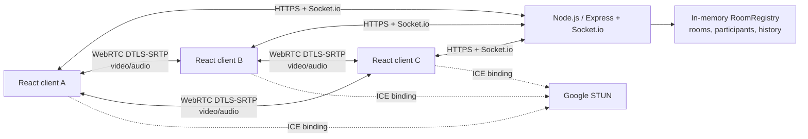
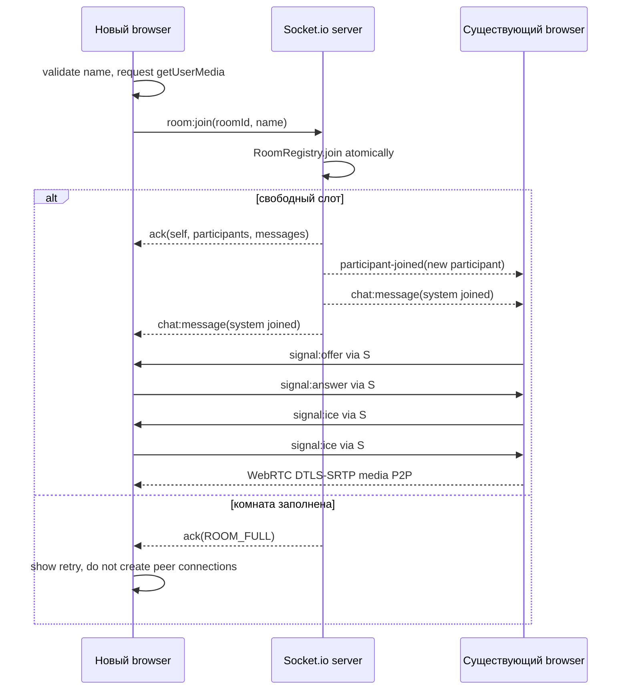

# TDD — Видеочат-комната

| Поле | Значение |
| --- | --- |
| Версия | 4.0 |
| Дата | 2026-09-16 |
| PRD | [`prd-video-chat-room.md`](../../prd-video-chat-room.md) (v1.0) |
| Feature name | `video-chat-room` |
| Статус | TBD-1–TBD-4 закрыты; решения включены в дизайн |

Исходная версия: [`design-video-chat-room-v3.md`](design-video-chat-room-v3.md). Основание изменений — ответы пользователя в её разделе 14. V4 сохраняет разделение ожидаемого/неожиданного disconnect и модель UUID / UserMessage / SystemMessage, уточняя деплой, наблюдаемость, историю и тексты ошибок.

## 1. Overview / Контекст

Нужно создать русскоязычное desktop-веб-приложение (Chrome, Firefox и Edge 100+, ширина от 1024 px) для видеозвонка до четырёх равноправных участников. Пользователь вводит имя, создаёт комнату либо входит по URL, обменивается аудио/видео и сообщениями. Регистрации, постоянного хранения, ролей, TURN, мобильной версии и автоматического переподключения нет.

Зафиксированные PRD ограничения: JavaScript ES6+, React в браузере, Node.js на сервере, Socket.io для сигналинга/чата и WebRTC mesh для медиа. При четырёх участниках mesh образует максимум шесть `RTCPeerConnection`; каждый клиент передаёт максимум трём peers. Медиа проходит P2P, сервер не является медиасервером.

Технические решения этого TDD:

- React SPA собирается Vite; сервер — Node.js + Express + Socket.io. Express обслуживает health endpoint и production-статические файлы, Socket.io работает на том же HTTPS origin.
- URL комнаты: `/room/:roomId`. При создании `roomId` — `crypto.randomUUID()`. При входе разрешается нормализованный сегмент `^[A-Za-z0-9_-]{1,64}$`; отсутствующая комната с допустимым ID создаётся при успешном входе.
- Комнаты, участники и история существуют только в памяти одного процесса. Следовательно, MVP запускается одним экземпляром сервера; горизонтальное масштабирование без общего state не допускается.
- STUN-конфигурация: `stun:stun.l.google.com:19302`. TURN отсутствует по PRD; частичная недостижимость peer при строгом NAT показывается в UI как проблема подключения конкретного участника, но не завершает комнату.
- Максимум сообщения — 2 000 Unicode code points; сервер применяет простой per-socket rate limit 10 сообщений/10 секунд. Это выбранная реализация пункта «защита от флуда» PRD.
- Деплой — один Render Web Service, обслуживающий SPA и Socket.io. Домен, TLS и reverse proxy предоставляет Render; отдельный frontend-хостинг не нужен.
- Наблюдаемость — встроенные Logs и Metrics в Render, без внешних сервисов. Срок хранения логов — 7 дней; реализация через план workspace описана в разделе 12.
- История комнаты — последние 500 сообщений суммарно для пользовательских и системных событий. Это подтверждённое пользователем уточнение требования PRD об истории за время жизни комнаты.
- Утверждённые русские тексты ошибок собраны в разделе 8 и используются одинаково во всех соответствующих состояниях UI.

## 2. Current Architecture & Codebase Summary

Репозиторий повторно проверен при подготовке v4: исходного кода, зависимостей, конфигурации запуска, тестов и схем БД по-прежнему нет. Присутствуют входные документы и TDD v1–v3; `prd-tasks.mdc` не используется на этапе PRD → TDD. Все перечисленные ниже компоненты остаются проектируемыми.

Текущая структура (работающей архитектуры приложения пока нет):

```text
Repository
├── prd-video-chat-room.md — требования
├── prd-design.mdc — правила TDD
├── prd-tasks.mdc — правила следующего этапа
└── prds/video-chat-room/ — TDD v1–v3, включая ответы на TBD в v3
```

| Путь | Класс / функция | Назначение / находка |
| --- | --- | --- |
| `prd-video-chat-room.md` | PRD v1.0 | Функциональные требования, acceptance criteria и обязательный стек. |
| `prd-design.mdc` | Правило TDD | Обязательная структура настоящего документа; production-код не создаётся. |
| `prds/video-chat-room/design-video-chat-room-v3.md` | TDD v3, раздел 14 | Базовый дизайн, UUID участников и типы сообщений; ответы пользователя закрывают четыре TBD. |
| Исходные модули | — | Отсутствуют; существующей архитектуры, API, БД и тестов нет. |

Начальная целевая структура, которую создаст реализация (это план, не существующий код):

```text
client/src/
  app/                 # router, composition root
  features/room/       # join flow, room screen, media controls
  entities/participant/ # presentation models and tiles
  shared/socket/       # Socket.io client and contracts
  shared/webrtc/       # peer-connection manager
server/src/
  app.js               # Express/HTTP/Socket.io composition
  rooms/roomRegistry.js # in-memory room lifecycle, invariant <= 4
  socket/roomGateway.js # validated Socket.io event handlers
  validation/          # name, room ID and message validation
shared/                # event names and payload schemas
```

## 3. Proposed Architecture / High-Level Design



В production HTTPS/WSS завершается на reverse proxy Render; далее HTTP и Socket.io поступают на общий порт одного Node.js-процесса. SPA и socket-клиент используют один origin. TLS-сертификат на Node.js вручную не устанавливается. Такой маршрут соответствует модели [Render Web Services](https://render.com/docs/web-services) и [управляемого TLS](https://render.com/docs/tls).

Сервер — источник истины только для состава комнаты, истории текущей сессии и системных событий. Он не проксирует media и не записывает данные. В браузере `RoomSession` координирует Socket.io, `MediaController` управляет локальными треками, а `PeerConnectionManager` хранит соединение на каждого удалённого участника. Все DOM-тексты отображаются React как текст, не HTML.

`RoomRegistry.join()` выполняется синхронно внутри единственного Node event loop и возвращает результат до рассылки событий. Поэтому проверка свободного слота и добавление участника составляют одну неразрывную операцию. Нельзя проверять размер комнаты отдельно от добавления в Socket.io handler.

## 4. Components & Interfaces

| Компонент | Ответственность | Входы / выходы |
| --- | --- | --- |
| `LandingPage` / `JoinDialog` | Ввод имени, локальная проверка, генерация нового room ID, переход по URL. | `create room`, `join room`; ошибок сети ещё нет. |
| `RoomPage` | Композиция сетки, self-view, чата, списка и состояния ошибок. | Модели участников, сообщения, media state. |
| `RoomSession` | Единственный владелец socket-сессии; отключает Socket.io reconnection; вызывает join/leave. | Socket events ↔ UI store и `PeerConnectionManager`. |
| `MediaController` | Проверяет WebRTC, запрашивает media, останавливает/recreates video track, включает/выключает аудио, обрабатывает `ended`. | `MediaStream`, `{audioEnabled, videoEnabled}`, предупреждения. |
| `PeerConnectionManager` | По одному `RTCPeerConnection` на remote participant, SDP/ICE, remote streams, cleanup. | `signal:offer/answer/ice`, `peerConnectionState`. |
| `RoomRegistry` | `Map<roomId, Room>`; атомарное join, leave, очистка пустой комнаты, журнал сообщений. | Доменный результат `joined` или `ROOM_FULL`. |
| `RoomGateway` | Валидирует Socket.io payload, применяет registry и направляет события только сокетам той же комнаты. | Контракты раздела 6. |
| HTTP app | `/healthz`, статика SPA, TLS-terminating deployment boundary. | `GET /healthz → 200`. |

Клиент должен создавать socket с `reconnection: false` и `autoConnect: false`. Он соединяется только после явного действия входа пользователя («Создать комнату», «Войти» или «Повторить вход»). Обработка `disconnect` зависит от состояния текущей сессии:

- **Ожидаемый disconnect:** клиент намеренно завершает сессию по кнопке «Выйти», при уходе со страницы комнаты или закрытии/перезагрузке вкладки. `RoomSession` устанавливает состояние `leaving` до отправки `room:leave` и до вызова `socket.disconnect()`. UI завершает выход без сообщения о потере связи; по кнопке «Выйти» открывается стартовый экран.
- **Неожиданный disconnect:** соединение прерывается без инициированного клиентом завершения сессии, в том числе при потере сети или отключении сервером. UI переходит в состояние `disconnected` с сообщением «Соединение с сервером потеряно. Войдите снова.». Возврат возможен только новым ручным входом.

В обоих случаях очистка идемпотентна: закрываются peer connections, останавливаются все локальные media tracks, снимаются обработчики и очищается состояние сессии. Автопереподключение и silent rejoin запрещены. Ожидаемость определяется намерением завершить конкретную сессию, а не только строкой причины `disconnect`. Программное отключение при обработке ошибки входа сохраняет исходную ошибку (например, «Комната заполнена.»), не заменяя её сообщением о потере связи. Запоздалые события завершённой сессии не изменяют состояние нового ручного входа.

### Инварианты домена

1. У участника есть один доменный идентификатор `Participant.id` — UUID v4, созданный сервером при успешном входе, — и одна комната. Поля `participantId`, `targetId` и `fromId` в контрактах ссылаются на этот же ID. Транспортный `socket.id` хранится только в привязке соединения на сервере и не входит в `Participant`.
2. У комнаты от 1 до 4 участников. Пустая комната удаляется вместе с `messages` немедленно после `leave`/`disconnect`.
3. Имя не уникально; идентичность и адресация сигналинга используют только internal ID.
4. Участник считается членом комнаты только после `room:join` acknowledgement `ok: true`; только тогда ему разрешены message, signal и media-state events.
5. Сервер никогда не отправляет входящий клиентский payload напрямую без validation/normalization.

## 5. Data Model & DB Changes

База данных, миграции, индексы и persistent cache не нужны: PRD требует in-memory state лишь на время жизни комнаты.

### Идентичность участника и транспорт

У `Participant` только одно поле идентичности — `id`. Сервер генерирует UUID v4 через `crypto.randomUUID()` при каждом успешном новом входе. Повторный ручной вход и отдельная вкладка создают нового участника с новым ID; имя может совпадать. UUID не является средством авторизации. Перед добавлением сервер проверяет отсутствие ID среди активных участников; при коллизии генерирует новый.

`socket.id` обозначает транспортное соединение, а не участника доменной модели. `RoomGateway` хранит отдельную серверную привязку `socket.id → {roomId, participantId}` и обратный индекс `participantId → socket.id` для адресного сигналинга. Эти индексы создаются только при успешном join и удаляются при leave/disconnect. В одном синхронном обработчике проверка слота, добавление участника и регистрация привязок выполняются без `await`; отклонённый вход не оставляет привязок.

Таким образом, `Room.participants` — `Map<Participant.id, Participant>`; ключ обязан совпадать с `Participant.id`. Повтор ID в ключе Map нужен для поиска, а в объекте — для передачи участника клиенту. Отдельного поля `Participant.socketId` нет. На границе Socket.io Map сериализуется в массив объектов участников; внутренние транспортные привязки не передаются клиенту.

### Room и варианты сообщений

Ниже пример структуры в памяти, а не production-код. `Room.messages` содержит объединение двух вариантов: `UserMessage` и `SystemMessage`, различаемых по `type`.

```js
const roomExample = {
  id: 'a6ad54a8-2f4f-4f0c-9c4f-a3346ba0202c',
  participants: new Map([
    ['1bb74257-47a1-4aab-a120-e63349d7be45', {
      id: '1bb74257-47a1-4aab-a120-e63349d7be45',
      displayName: 'Алекс',
      audioEnabled: true,
      videoEnabled: true,
      joinedAt: '2026-09-16T10:00:00.000Z'
    }]
  ]),
  messages: [
    {
      id: 'b0da27a0-0e0c-466c-8c9e-a717937d0b06',
      type: 'system',
      author: { type: 'system' },
      event: 'participant-joined',
      participant: {
        id: '1bb74257-47a1-4aab-a120-e63349d7be45',
        displayName: 'Алекс'
      },
      createdAt: '2026-09-16T10:00:00.000Z'
    },
    {
      id: 'fcf3b0f5-a75c-48d9-bde7-969f74dcbec0',
      type: 'user',
      author: {
        type: 'participant',
        participantId: '1bb74257-47a1-4aab-a120-e63349d7be45',
        displayName: 'Алекс'
      },
      text: 'Привет!',
      createdAt: '2026-09-16T10:00:05.000Z'
    }
  ]
}
```

| Вариант | Обязательные поля | Правила |
| --- | --- | --- |
| Оба | `id`, `type`, `author`, `createdAt` | `id` сообщения — серверный UUID v4; `createdAt` — серверная дата UTC ISO-8601. |
| `UserMessage` | `type: 'user'`, `author: {type: 'participant', participantId, displayName}`, `text` | Автор определяется сервером по привязке socket к участнику; `text` проходит валидацию. Полей `event` и `participant` нет. |
| `SystemMessage` | `type: 'system'`, `author: {type: 'system'}`, `event`, `participant: {id, displayName}` | `event` — строго `'participant-joined'` или `'participant-left'`. `participant` — участник события, не автор. Поля `text` нет. |

Неиспользуемые поля отсутствуют, а не заполнены `null`, строкой `'null'` или условным ID `'system'`. Система явно обозначена через `author.type`; она не является участником и не занимает слот.

Имена и ID в `UserMessage.author` и `SystemMessage.participant` — снимки на момент события. Они сохраняются в истории после выхода участника: для отображения нельзя искать имя в текущем `Room.participants`. Повторный вход с тем же именем не меняет авторство прошлых сообщений.

Текст системного сообщения формирует клиент по `event` и снимку имени: «{displayName}: присоединился к комнате» / «{displayName}: покинул комнату». Имя выводится как безопасный текст. Сервер создаёт системные сообщения сам; клиент не может передать `author`, `type`, `event`, `id` или время через `chat:send`.

Лимит истории подтверждён ответом на TBD-3: `Room.messages` хранит последние 500 сообщений, включая `UserMessage` и `SystemMessage`. Единая операция добавления сначала записывает новое сообщение, затем удаляет самые старые записи до размера ≤ 500. Порядок определяется серверной последовательностью добавления, а не сортировкой по UUID или времени клиента. Удалённые записи не архивируются и не восстанавливаются.

Поздний участник получает доступный snapshot последних сообщений. Чтобы snapshot и live-событие входа не дублировались, сервер в одном синхронном обработчике фиксирует snapshot до добавления собственного `participant-joined`, отправляет его в join acknowledgement, затем добавляет и рассылает событие входа через общую операцию истории. Клиент добавляет события по `message.id` без дублей и также оставляет максимум 500 последних записей после объединения snapshot и live-событий. Новое сообщение вызывает автопрокрутку. При удалении комнаты история исчезает сразу — семидневное хранение технических логов к переписке не относится.

Поле `createdAt` хранится сервером в UTC ISO-8601. Клиент форматирует его через `Intl.DateTimeFormat` в локальном timezone пользователя как `HH:mm`; сервер не должен рассчитывать «локальное время клиента».

## 6. API / Contracts

### HTTP

| Метод / путь | Ответ | Назначение |
| --- | --- | --- |
| `GET /healthz` | `200 {"status":"ok"}` | Liveness/readiness для deployment. |
| `GET /room/:roomId` | SPA HTML | Клиент читает `roomId` из router. |
| `GET /*` | SPA HTML | Стартовая страница и client routing. |

HTTP не содержит комнатной логики и не имеет REST API для сообщений/участников.

### Socket.io events

| Направление | Событие | Payload / acknowledgement | Семантика |
| --- | --- | --- | --- |
| C→S | `room:join` | `{roomId, displayName}` → `{ok:true, self, participants, messages}` или `{ok:false, code, message}` | Валидирует, атомарно резервирует слот, создаёт комнату при отсутствии. |
| S→C | `room:participant-joined` | `{participant}` | Рассылается прежним членам после join; они инициируют WebRTC offer новому peer. |
| S→C | `room:participant-left` | `{participantId}` | Удаляет tile/PC. Системное сообщение поступает отдельно через `chat:message`. |
| C→S | `room:leave` | `undefined` → `{ok:true}` | Идемпотентный explicit leave; затем socket disconnect. |
| C→S | `chat:send` | `{text}` → `{ok:true}` или validation error | Сервер normalizes, appends user message, broadcast. |
| S→C | `chat:message` | `UserMessage` или `SystemMessage` из раздела 5 | Сообщение для всех членов; UI выбирает представление по `type`. |
| C→S | `media:state` | `{audioEnabled, videoEnabled}` | Обновляет state участника и broadcast. |
| S→C | `room:media-state` | `{participantId, audioEnabled, videoEnabled}` | Обновляет remote tile; не заменяет WebRTC track operation. |
| C→S | `signal:offer` / `signal:answer` | `{targetId, sdp}` | Relay только target из той же комнаты. |
| C→S | `signal:ice` | `{targetId, candidate}` | Relay только target из той же комнаты. |
| S→C | `signal:offer` / `signal:answer` / `signal:ice` | `{fromId, sdp|candidate}` | Адресный signaling relay. |
| S→C | `server:error` | `{code, message}` | Невосстановимая ошибка протокола; клиент оставляет/покидает комнату согласно коду. |

В `self`, `participants` и `room:participant-joined.participant` передаётся `Participant` из раздела 5. `participantId`, `targetId`, `fromId` — доменные UUID, а не Socket.io ID. Сервер получает отправителя из своей привязки socket, проверяет членство обоих участников в одной комнате, затем разрешает `targetId` в socket через обратный индекс. Клиент не задаёт `fromId`.

Пример join:

```json
{ "roomId": "a6ad54a8-2f4f-4f0c-9c4f-a3346ba0202c", "displayName": "Алекс" }
```

```json
{
  "ok": true,
  "self": {
    "id": "1bb74257-47a1-4aab-a120-e63349d7be45",
    "displayName": "Алекс",
    "audioEnabled": false,
    "videoEnabled": false,
    "joinedAt": "2026-09-16T10:00:00.000Z"
  },
  "participants": [
    {
      "id": "4ab4986e-0510-4b42-b853-bde154ce7954",
      "displayName": "Мария",
      "audioEnabled": true,
      "videoEnabled": true,
      "joinedAt": "2026-09-16T09:59:00.000Z"
    }
  ],
  "messages": [
    {
      "id": "85e8b4da-d91c-4f3b-9336-bd166574a492",
      "type": "system",
      "author": {
        "type": "system"
      },
      "event": "participant-joined",
      "participant": {
        "id": "4ab4986e-0510-4b42-b853-bde154ce7954",
        "displayName": "Мария"
      },
      "createdAt": "2026-09-16T09:59:00.000Z"
    }
  ]
}
```

Ошибки acknowledgement: `INVALID_ROOM_ID`, `INVALID_DISPLAY_NAME`, `ROOM_FULL`, `NOT_IN_ROOM`, `INVALID_MESSAGE`, `RATE_LIMITED`, `INVALID_SIGNAL_TARGET`. UI показывает «Комната заполнена.» только для `ROOM_FULL`; прочие сообщения — понятные русские, без технических деталей.

## 7. Data & Control Flows

### Вход и установление mesh



Порядок важен: media permission может быть запрошен до `room:join`, но отказ, отсутствие устройства или `NotFoundError` не отменяют join. В таком случае `MediaController` создаёт пустой stream и state `false/false`; пользователь входит, а сервер рассылает его корректные state. Нажатие «Войти» является жестом autoplay. Если браузер всё же блокирует `video.play()`, tile показывает кнопку «Включить звук», повторно вызывающую `play()` по жесту.

### Управление камерой и микрофоном

1. Микрофон: установить `audioTrack.enabled = false`, немедленно отправить `media:state`; удалённые peers больше не получают аудиокадры. При включении — `true`.
2. Камера off: выполнить `videoTrack.stop()`, удалить локальный video track из локального stream, для всех video senders вызвать `replaceTrack(null)`, затем `media:state(videoEnabled:false)`.
3. Камера on: вызвать `getUserMedia({video:true,audio:false})`, добавить новый track, `replaceTrack(newTrack)` для каждого peer, затем broadcast true. Если получить track не удалось, остаться без видео и показать объяснение.
4. Событие `track.onended` выполняет тот же путь off. Настройка нового устройства — только средствами browser/OS, UI device picker не строится.

### Сообщение, leave и disconnect

При добровольном выходе клиент сначала фиксирует `leaving` и сразу освобождает media/peer connections. Если socket подключён, он отправляет `room:leave`; после acknowledgement или таймаута 2 секунды вызывает `socket.disconnect()` и завершает выход. Потеря связи во время `leaving` не превращает добровольный выход в ошибку. При закрытии/перезагрузке вкладки ожидание acknowledgement не требуется. При неожиданном disconnect очистка выполняется немедленно, без ожидания серверного подтверждения; сервер освобождает слот после обнаружения отключения.

`chat:send` проходит trim, Unicode-length/rate проверки и серверную нормализацию. Сервер добавляет сообщение в room history и одним broadcast отправляет его всем текущим членам. Поздний участник получает snapshot history в `room:join` ack.

При `room:leave` и Socket.io `disconnect` шлюз получает `{roomId, participantId}` из серверной привязки socket и вызывает единую идемпотентную `RoomRegistry.leave(roomId, participantId)`. Она сохраняет снимок `{id, displayName}` уходящего участника, удаляет участника, добавляет `SystemMessage` с `event: 'participant-left'`, рассылает `room:participant-left` и `chat:message` оставшимся и удаляет Room при нуле членов. Шлюз удаляет обе транспортные привязки; повторный leave/disconnect без привязки ничего не делает. Для обрыва применяется тот же тип события и текст: причина не сообщается. В `pagehide` клиент best-effort отправляет `room:leave`, но серверный `disconnect` остаётся авторитетным fallback.

## 8. Error Handling & Edge Cases

### Утверждённые тексты (ответ на TBD-4)

| Состояние | Точный текст UI | Поведение |
| --- | --- | --- |
| Отказ в разрешении камеры/микрофона | «Нет доступа к камере или микрофону. Вы можете продолжить без них и изменить разрешение в настройках браузера.» | Пользователь остаётся в комнате; недоступные дорожки выключены. |
| WebRTC не поддерживается | «Ваш браузер не поддерживает видеозвонки WebRTC. Используйте актуальную версию Chrome, Firefox или Edge.» | Вход в звонок заблокирован; показана инструкция. |
| Не удалось подключить media конкретного peer | «Не удалось установить медиасоединение с этим участником.» | Сообщение на соответствующей плитке; чат и остальные media-соединения продолжают работать. |
| Сервер недоступен при входе или неожиданно отключился | «Соединение с сервером потеряно. Войдите снова.» | Повторный вход только вручную; ресурсы попытки/сессии освобождаются. |
| Нет свободного слота | «Комната заполнена.» | Показана кнопка «Повторить вход». |

Эти строки — единый каталог UI; серверные коды ошибок сопоставляются с ним на клиенте. Ожидаемый disconnect не показывает ошибку сервера. Отказ доступа, отсутствие устройства и отсутствие secure context различаются по причине: для последних двух нужны соответствующие пояснения, а не ошибочное утверждение об отказе в разрешении. При недоступности STUN сообщение о peer появляется только если медиасоединение действительно не установлено; сама ошибка STUN не завершает комнату.

### Обработка сценариев

| Сценарий | Обработка | Состояние пользователя |
| --- | --- | --- |
| Пустое/некорректное имя | Клиент блокирует submit; сервер повторно валидирует. | «Введите имя» / «Допустимы буквы, цифры, пробел и дефис». |
| Пятый или гонка за четвёртый слот | Атомарный `join` возвращает `ROOM_FULL`; socket не добавлен. | «Комната заполнена.», кнопка «Повторить вход». |
| Room ID не существует | Создать room внутри `join`. | Обычный вход первого участника. |
| Сервер / Socket.io недоступен при входе | `connect_error` или timeout join завершают попытку и освобождают ресурсы. | Утверждённый текст о сервере; повтор только вручную. |
| Ожидаемый disconnect | Сессия уже в `leaving`; идемпотентная очистка, включая локальные tracks. | Штатный выход без сообщения о потере связи. |
| Неожиданный disconnect | Без локального намерения завершить сессию: очистка и переход в `disconnected`. | «Соединение с сервером потеряно. Войдите снова.»; вход только вручную. |
| Нет WebRTC/secure context | До подключения проверить `RTCPeerConnection`, `mediaDevices.getUserMedia`, `window.isSecureContext`. | Утверждённый текст о WebRTC; для небезопасного контекста — «Для видеозвонка откройте приложение по HTTPS.» |
| Permission denied / нет devices | Различать `NotAllowedError`, `NotFoundError`, `NotReadableError`; join не отменять. | При отказе — утверждённый текст; при отсутствии/занятости — «Камера или микрофон недоступны. Проверьте устройства в настройках браузера или ОС.» Соответствующее media выключено. |
| STUN/ICE failure | `iceconnectionstate` `failed`, закрыть только этот PC; media state участника не менять. | Tile с «Не удалось установить медиасоединение с этим участником.». |
| Remote disconnect | Unified leave; закрыть его PC, удалить tile, system message. | Оставшиеся продолжают звонок. |
| XSS в имени/сообщении | Normalization + length limits на сервере; React rendering only. | Текст безопасно показывается как текст. |
| Дублированный leave/disconnect | `leave` returns no-op после первого удаления. | Нет дублированного system message. |
| Перезагрузка | Предыдущая socket-сессия уничтожается, новый join требует имя. | Нет сохранения в localStorage. |

## 9. Performance & Scalability

- Цель PRD: media latency не более 500 мс в LAN. Проверять e2e в локальном стенде с 2–4 browser contexts; измерять WebRTC `getStats()` (RTT, jitter, frames, candidate pair) без отправки персональных данных.
- Потолок комнаты — четыре, поэтому максимум 6 P2P connections и 3 video senders на client. Новые продуктовые требования на >4 означают переход к SFU и выходят за границы дизайна.
- Серверная CPU/сеть масштабируется по небольшим Socket.io payloads; тяжёлый трафик медиа не проходит через него. История ограничена 500 сообщениями, message body — 2 000 code points.
- Один instance обязателен до появления shared RoomRegistry/Socket.io adapter. Несколько instance за балансировщиком без sticky sessions и общего state нарушат join, signaling и room capacity.
- Наблюдаемость реализуется встроенными Render Logs и Metrics без внешнего коллектора. CPU, память и доступные для выбранного плана показатели сети смотрим в [Render Metrics](https://render.com/docs/service-metrics). Эти графики не заменяют измерение P2P media latency.
- Прикладные показатели — active rooms, active participants, `ROOM_FULL`, ошибки валидации, socket connects/disconnects, ошибки relay и rate-limit — агрегируются в памяти и раз в 60 секунд выводятся одной JSON-строкой в stdout. Это записи для поиска в Render Logs, а не обещание пользовательских графиков Render Metrics. Ошибки сервера идут в stderr с безопасным кодом и временем; payload, имена, message text, room URL, SDP и ICE candidates не логируются. Клиентские ICE-ошибки в MVP доступны в UI и локальной диагностике; новый API телеметрии не вводится.
- Логи сохраняются 7 дней средствами Render. Приложение не пишет их на диск, не архивирует и не подключает внешние сервисы; проверка плана workspace описана в разделе 12.

## 10. Security & Compliance

- HTTPS обязателен в production; домен и TLS-сертификат предоставляет Render, TLS завершается на его reverse proxy. Приложение выставляет HSTS в production; локально допустим `localhost`. Socket.io подключается к тому же публичному origin по HTTPS/WSS.
- AuthN/AuthZ намеренно отсутствуют: room URL — bearer-like invitation, которую можно угадать/переслать. Это документированный риск PRD, не баг. Сервер всё равно авторизует действие на уровне socket membership: sender и signal target обязаны находиться в одной комнате.
- `displayName` допускает только Unicode letters/numbers, пробел, `-` и `_`; после trim максимум 30 code points. Не использовать имя в HTML, CSS class, URL или log field без escaping.
- Сообщения — plain text. Сервер отбрасывает пустые, ограничивает длину и частоту. Клиент не использует `dangerouslySetInnerHTML`.
- WebRTC использует DTLS-SRTP штатно. Сквозное application-level E2EE не реализуется; TURN и записи также отсутствуют.
- PII минимальны и эфемерны: отображаемое имя и текст живут в RAM до удаления комнаты. Не писать message content, SDP, candidates или IP-derived ICE data в логи/аналитику. Технические логи в Render хранятся 7 дней; их содержимое ограничено диагностическими полями. История чата удаляется по отдельным правилам комнаты и не попадает в логи.
- Production CSP: `default-src 'self'; connect-src 'self' wss://<service>.onrender.com; media-src 'self' blob:; img-src 'self' data:; object-src 'none'; base-uri 'self'; frame-ancestors 'none'`. `<service>.onrender.com` заменяется фактическим доменом сервиса при деплое; это шаблон, не буквальное значение заголовка. HTTP polling разрешён через `'self'`, WebSocket — через точный WSS origin. Wildcard `https:`/`wss:` не требуется. Точные origin для STUN не контролируются CSP, так как не являются fetch/connect source.

## 11. Testing Strategy

| Уровень | Покрытие | Основные проверки |
| --- | --- | --- |
| Unit: server | `RoomRegistry`, validation, rate limiter | Atomic 3→4→full, cleanup at zero, duplicate names, unknown ID creates room, duplicate leave, message cap (500 → 501 удаляет старейшее, включая системные события); новый UUID при каждом входе, согласованность ключа Map и Participant.id, очистка транспортных привязок, обязательные поля обоих вариантов сообщений, сохранение снимков автора/участника после выхода. |
| Unit: client | media and UI state reducers | Name validation, placeholders, date format, XSS rendered as text, video track stop/recreate, no local persistence; ожидаемый/неожиданный disconnect, потеря связи во время leaving, сохранение исходной ошибки входа, игнорирование событий старой сессии. |
| Integration: Socket.io | Real server + multiple socket clients | Join snapshot, signaling isolation between rooms, message history (поздний вход получает последние 500 после обработки live-события, без дубля собственного входа), system events, invalid target, disconnect frees slot, reconnection disabled client config; адресация по participant UUID, запрет подмены автора и отправки системных сообщений клиентом. |
| Browser integration | Headless browsers with fake media | 1–4 tiles, controls/status events, full-room retry, permission/WebRTC/server-error screens, page reload needs name; добровольный выход без ошибки, обрыв с сообщением и без auto-reconnect, cleanup даже при отсутствии leave acknowledgement. |
| E2E/manual | Chrome/Firefox/Edge 100+ on HTTPS | Two/four real peers, offer/answer/ICE, audio/video, local camera LED turns off, clipboard link, autoplay gesture, close-tab scenario. |
| Load/soak | Socket-only and small real-room soak | Many independent 1–4 person rooms, bounded heap history, no leaked socket or PC after repeated join/leave. |

Дополнительно проверить точное совпадение пяти утверждённых строк с каталогом раздела 8, подпись лимита истории, отсутствие чувствительных данных в stdout/stderr и запись агрегированных счётчиков. На стенде Render проверить HTTPS/WSS, прямое открытие `/room/:roomId`, `/healthz`, origin/CSP, доступность Logs/Metrics и установленный срок хранения логов. Исходники и тесты ещё не созданы; здесь приведён план проверки будущей реализации.

Coverage targets: ≥80% branches for server registry/validation and ≥70% for deterministic client state logic. WebRTC device behavior cannot be reliably unit-tested; it requires the manual matrix above. CI must fail on lint, unit, integration and browser smoke failures.

## 12. Deployment & Migration Plan

### Целевое окружение

Один Node.js-процесс в одном Render Web Service. Он обслуживает собранную SPA, `/healthz` и `/socket.io/`; Redis, БД, persistent disk и отдельный proxy не требуются. Домен вида `<service>.onrender.com`, сертификат и reverse proxy предоставляет Render. HTTP-сервер слушает `0.0.0.0` и порт из `PORT`; точное имя домена подставляется после создания сервиса. [Render Web Services](https://render.com/docs/web-services)

Для хранения логов 7 дней целевой workspace — Hobby: срок задаётся планом workspace, а не переменной приложения. Это не выбор бесплатного compute-инстанса: тип вычислительного инстанса выбирается отдельно. Если используется другой workspace, перед релизом необходимо проверить соответствие срока хранения принятому требованию; нельзя выдавать произвольный `LOG_RETENTION_DAYS` за работающую настройку Render. [Render Logs](https://render.com/docs/logging)

### Конфигурация

| Параметр | Значение / назначение |
| --- | --- |
| `NODE_ENV` | `production`. |
| `PORT` | Порт, предоставленный Render; bind на `0.0.0.0`. |
| `PUBLIC_ORIGIN` | Фактический `https://<service>.onrender.com`; источник для allowed origin и точного WSS origin в CSP. |
| `STUN_URL` | `stun:stun.l.google.com:19302`; передать клиенту как публичную конфигурацию, поскольку STUN использует браузер. |
| `LOG_LEVEL` | `info`; только безопасные структурированные записи в stdout/stderr. |
| Health check path | `/healthz`. |
| Instance count | 1; без autoscaling и Node cluster. |

Сокет-клиент использует текущий origin. Сервер применяет allowlist origin для HTTP polling и WebSocket handshake, а не только CORS-заголовки. Для локальной разработки разрешается отдельный явный localhost origin. Никакие служебные настройки сервера или секреты в публичную клиентскую конфигурацию не включаются.

### Последовательность релиза и rollback

1. Зафиксировать версии зависимостей и воспроизводимую сборку; CI выполняет lint, unit, integration и browser smoke. В будущих package scripts предусмотреть `build` для SPA и `start` для Node-сервера; сейчас этих файлов нет.
2. Создать Render Web Service для репозитория, указать build/start-команды, один instance, `/healthz` и переменные из таблицы. Записать назначенный домен в `PUBLIC_ORIGIN`. Проверить TLS, Logs/Metrics и семидневный retention.
3. Для stateful MVP использовать управляемые релизы в окне обслуживания: отключить auto-deploy. Перед заменой процесса закрыть доступ пользователей к сервису на время обслуживания, затем развернуть проверенный commit и открыть доступ после завершения переключения. Это предотвращает новые joins в разные поколения in-memory state при временном перекрытии старого и нового процессов. Возможность ручного деплоя и режим `Auto-Deploy: Off` описаны в [Render Deploys](https://render.com/docs/deploys).
4. Выполнить smoke на фактическом HTTPS-домене: create → второй join → чат → media controls → leave; отдельно прямой переход по invite URL, пятый участник, утверждённые тексты ошибок и WSS upgrade.
5. Проверить runtime-логи и встроенные метрики. Переписка, имена, SDP и ICE в логи не попадают; ошибок CSP/origin нет.
6. Для rollback в том же окне обслуживания вернуть предыдущий проверенный артефакт/commit и повторить smoke. Комнаты и сообщения прежнего процесса не восстанавливаются.

Деплой, рестарт или rollback прекращает сессии соответствующего процесса; клиенты получают неожиданный disconnect и возвращаются вручную. WebSocket-соединения Render закрываются при замене инстанса, поэтому доступность HTTP во время деплоя не означает непрерывность звонка. [Render WebSockets](https://render.com/docs/websocket)

Миграции данных отсутствуют. Продуктовый feature flag для первого релиза не нужен. Локальный запуск использует localhost; боевое окружение — HTTPS на Render.

## 13. Risks & Mitigations

| Риск | Влияние | Митигирование |
| --- | --- | --- |
| Symmetric/strict NAT без TURN | Пара участников не получит media. | Явный tile error, публичный STUN, документированное ограничение PRD. |
| Mesh нагружает upload/CPU | Деградация при 4 участниках. | Жёсткий server limit 4, тесты в целевых браузерах; SFU — отдельная будущая инициатива. |
| Restart / multiple server instances | Потеря комнаты либо split-brain, в том числе при перекрытии поколений во время deploy. | Один instance, управляемое окно обслуживания и закрытие пользовательского доступа на время переключения; возврат в звонок вручную. |
| Camera API различается между browser/OS | Невозможно восстановить устройство автоматически. | `ended` handling, safe fallback placeholder, восстановление через browser/OS по PRD. |
| Autoplay blocking | Удалённый звук молчит. | Join click и fallback «Включить звук». |
| Утечка peer connections/tracks | Память, камера остаётся активной. | Single cleanup path on leave/disconnect/unmount; automated repeated join/leave test. |
| Открытые invite URLs | Несанкционированный доступ к звонку. | Осознанное PRD-ограничение; UUID при создании уменьшает угадывание, но не заменяет auth. |
| Flood/XSS | Нагрузка или небезопасный UI. | Server validation/rate limit/body cap; text-only React rendering and CSP. |
| История старше 500 записей | Поздний участник не увидит удалённые записи. | Ограничение подтверждено ответом на TBD-3; явная подпись в чате, одинаковые правила для user/system. |
| Смена плана Render workspace | Срок хранения логов может перестать соответствовать 7 дням. | Проверять retention перед релизом и изменением плана; внешнее хранение не подключать. |

## 14. Open Questions / TBD

Все четыре исходных TBD закрыты ответами пользователя в [TDD v3, раздел 14](design-video-chat-room-v3.md#14-open-questions--tbd). Ответы перенесены в нормативные решения документа.

| Исходный вопрос | Принятое решение | Где учтено |
| --- | --- | --- |
| TBD-1 — Deployment target | Render Web Service; домен, TLS и reverse proxy предоставляет Render. | Разделы 1, 3, 10, 12, 13. |
| TBD-2 — Observability and logs | Встроенные Render Logs/Metrics; логам 7 дней; внешних сервисов нет. Для этого срока целевой workspace — Hobby. | Разделы 1, 9–13. |
| TBD-3 — Session history cap | Последние 500 сообщений на комнату; включая user/system, старейшие удаляются. Это согласованное уточнение PRD, а не неподтверждённое допущение. | Разделы 1, 5, 7, 9, 11, 13. |
| TBD-4 — Failure UX wording | Пять утверждённых строк приведены дословно в разделе 8. | Разделы 4, 6, 8, 11. |

Нерешённых вопросов из исходного списка нет. Фактический поддомен и параметры Render service заполняются при создании окружения; это шаги настройки по разделу 12. Изменения в следующей итерации сохранять в `design-video-chat-room-v5.md`.
